# FMD architecture and next steps

Local tree is the source of truth. GitHub click targets assume `fred1357944/FMD` `main` after the next push.

```mermaid
flowchart TD

subgraph group_entry["Entry points"]
  node_main_cpp["C++ process<br/>Qt app bootstrap<br/>[src/main.cpp]"]
  node_main_qml["Main window<br/>QML host<br/>[src/Main.qml]"]
  node_tests["FmdTest<br/>Qt Test suite<br/>[tests/tst_fmd.cpp]"]
end

subgraph group_model["Document model"]
  node_backend["Backend<br/>files, workspace, settings<br/>[src/backend.cpp]"]
  node_frontmatter["Front matter<br/>YAML + outline + tags<br/>[src/frontmatter.cpp]"]
  node_mindmap["Mindmap tree<br/>parse / layout / mutate<br/>[src/mindmap.cpp]"]
  node_codeblocks["Code blocks<br/>fences, slash, preview split<br/>[src/codeblocks.cpp]"]
  node_highlighter["Markdown highlighter<br/>editor syntax<br/>[src/markdownhighlighter.cpp]"]
  node_pluginhost["Plugin host<br/>QJSEngine sandbox<br/>[src/pluginhost.cpp]"]
  node_uilocale["UI locale<br/>zh-TW / en<br/>[src/uilocale.cpp]"]
  node_systemtheme["System theme<br/>dark mode + text scale<br/>[src/systemtheme.cpp]"]
end

subgraph group_views["Views"]
  node_editor["Source editor<br/>QTextDocument<br/>[src/Main.qml]"]
  node_preview["Live preview<br/>GitHub markdown + cards<br/>[src/CodePreviewCard.qml]"]
  node_outline["Heading outline<br/>sidebar<br/>[src/OutlinePane.qml]"]
  node_table["Table view<br/>YAML status / date<br/>[src/ProjectTableView.qml]"]
  node_board["Board view<br/>status columns<br/>[src/ProjectBoardView.qml]"]
  node_calendar["Calendar view<br/>date field<br/>[src/ProjectCalendarView.qml]"]
  node_mindmap_view["Mindmap view<br/>outline + canvas<br/>[src/MindmapView.qml]"]
  node_threads["Threads preview<br/>local posts, no API<br/>[src/ThreadsPreview.qml]"]
  node_hotkeys["Hotkey editor<br/>QSettings overrides<br/>[src/HotkeysPane.qml]"]
  node_plugins_ui["Plugin manager<br/>enable / search<br/>[src/PluginsPane.qml]"]
end

subgraph group_delivery["Delivery"]
  node_qmake["qmake project<br/>[fmd.pro]"]
  node_qrc["Qt resources<br/>QML + fonts + builtin plugin<br/>[src/resources.qrc]"]
  node_bin_build["Build script<br/>[bin/build]"]
  node_bin_test["Test script<br/>[bin/test]"]
  node_install_macos["macOS install<br/>retarget Qt + codesign<br/>[bin/install-macos]"]
  node_app["FMD.app<br/>self-contained bundle<br/>[/Applications/FMD.app]"]
end

subgraph group_planned["Planned, not in this tree"]
  node_ios["iOS companion<br/>SwiftUI, same .md files<br/>[docs/IOS_COMPANION.md]"]
  node_license["Light license<br/>lifetime + optional sub"]
  node_plugin_store["Community plugin store"]
end

node_main_cpp -->|"creates Backend + PluginHost"| node_backend
node_main_cpp -->|"loads qrc:/Main.qml"| node_main_qml
node_systemtheme -->|"darkMode / textScale"| node_backend
node_main_qml -->|"context property backend"| node_backend
node_main_qml -->|"context property pluginHost"| node_pluginhost
node_editor -->|"attachDocument QTextDocument"| node_backend
node_backend -->|"plain text"| node_frontmatter
node_backend -->|"plain text"| node_mindmap
node_backend -->|"plain text"| node_codeblocks
node_backend -->|"QTextDocument"| node_highlighter
node_frontmatter -->|"headingOutline / tags / YAML fields"| node_outline
node_frontmatter -->|"projectRecords"| node_table
node_frontmatter -->|"status columns"| node_board
node_frontmatter -->|"date / due / scheduled"| node_calendar
node_frontmatter -->|"threads: true"| node_threads
node_mindmap -->|"tree + column layout"| node_mindmap_view
node_mindmap_view -->|"rename / add / reparent"| node_backend
node_codeblocks -->|"previewBlocks"| node_preview
node_pluginhost -->|"QJS fmd API"| node_backend
node_plugins_ui -->|"enable / reload"| node_pluginhost
node_hotkeys -->|"QSettings hotkeys/*"| node_backend
node_uilocale -->|"t(key)"| node_main_qml
node_qmake -->|"compiles"| node_main_cpp
node_qrc -->|"embeds QML"| node_main_qml
node_bin_build -->|"qmake + make"| node_qmake
node_bin_test -->|"tst_fmd"| node_tests
node_tests -->|"constructs Backend"| node_backend
node_install_macos -->|"copies binary, rewrites dylibs"| node_app
node_ios -.->|"same Markdown contract"| node_mindmap
node_ios -.->|"iCloud / Files vault"| node_backend
node_license -.->|"activation later"| node_app
node_plugin_store -.->|"not this host"| node_pluginhost

click node_main_cpp "https://github.com/fred1357944/FMD/blob/main/src/main.cpp"
click node_main_qml "https://github.com/fred1357944/FMD/blob/main/src/Main.qml"
click node_tests "https://github.com/fred1357944/FMD/blob/main/tests/tst_fmd.cpp"
click node_backend "https://github.com/fred1357944/FMD/blob/main/src/backend.cpp"
click node_frontmatter "https://github.com/fred1357944/FMD/blob/main/src/frontmatter.cpp"
click node_mindmap "https://github.com/fred1357944/FMD/blob/main/src/mindmap.cpp"
click node_codeblocks "https://github.com/fred1357944/FMD/blob/main/src/codeblocks.cpp"
click node_highlighter "https://github.com/fred1357944/FMD/blob/main/src/markdownhighlighter.cpp"
click node_pluginhost "https://github.com/fred1357944/FMD/blob/main/src/pluginhost.cpp"
click node_uilocale "https://github.com/fred1357944/FMD/blob/main/src/uilocale.cpp"
click node_systemtheme "https://github.com/fred1357944/FMD/blob/main/src/systemtheme.cpp"
click node_editor "https://github.com/fred1357944/FMD/blob/main/src/Main.qml"
click node_preview "https://github.com/fred1357944/FMD/blob/main/src/CodePreviewCard.qml"
click node_outline "https://github.com/fred1357944/FMD/blob/main/src/OutlinePane.qml"
click node_table "https://github.com/fred1357944/FMD/blob/main/src/ProjectTableView.qml"
click node_board "https://github.com/fred1357944/FMD/blob/main/src/ProjectBoardView.qml"
click node_calendar "https://github.com/fred1357944/FMD/blob/main/src/ProjectCalendarView.qml"
click node_mindmap_view "https://github.com/fred1357944/FMD/blob/main/src/MindmapView.qml"
click node_threads "https://github.com/fred1357944/FMD/blob/main/src/ThreadsPreview.qml"
click node_hotkeys "https://github.com/fred1357944/FMD/blob/main/src/HotkeysPane.qml"
click node_plugins_ui "https://github.com/fred1357944/FMD/blob/main/src/PluginsPane.qml"
click node_qmake "https://github.com/fred1357944/FMD/blob/main/fmd.pro"
click node_qrc "https://github.com/fred1357944/FMD/blob/main/src/resources.qrc"
click node_bin_build "https://github.com/fred1357944/FMD/blob/main/bin/build"
click node_bin_test "https://github.com/fred1357944/FMD/blob/main/bin/test"
click node_install_macos "https://github.com/fred1357944/FMD/blob/main/bin/install-macos"
click node_ios "https://github.com/fred1357944/FMD/blob/main/docs/IOS_COMPANION.md"

classDef toneBlue fill:#dbeafe,stroke:#2563eb,stroke-width:1.5px,color:#172554
classDef toneAmber fill:#fef3c7,stroke:#d97706,stroke-width:1.5px,color:#78350f
classDef toneMint fill:#dcfce7,stroke:#16a34a,stroke-width:1.5px,color:#14532d
classDef toneRose fill:#ffe4e6,stroke:#e11d48,stroke-width:1.5px,color:#881337
classDef toneIndigo fill:#e0e7ff,stroke:#4f46e5,stroke-width:1.5px,color:#312e81
class node_main_cpp,node_main_qml,node_tests toneBlue
class node_backend,node_frontmatter,node_mindmap,node_codeblocks,node_highlighter,node_pluginhost,node_uilocale,node_systemtheme toneAmber
class node_editor,node_preview,node_outline,node_table,node_board,node_calendar,node_mindmap_view,node_threads,node_hotkeys,node_plugins_ui toneMint
class node_qmake,node_qrc,node_bin_build,node_bin_test,node_install_macos,node_app toneRose
class node_ios,node_license,node_plugin_store toneIndigo
```

## Invariants

- One note is one Markdown file. YAML, lists, and fences live in that file. Table / board / calendar / mindmap are views, not a database.
- The editor `QTextDocument` is the live buffer. Backend reads and writes that buffer. Mindmap serialize must round-trip through it.
- Plugins speak `fmd` / `api` in QJSEngine. They are not Obsidian plugins.
- Threads publishing stays in `threads-schedule` CLI. The app does not call the Threads API.
- iOS is a later companion over the same `.md` files, not this QML shell compiled for iPhone.

## Next work (order)

1. **Harden the Mac writer.** Mindmap parse vs preview parity, canvas zoom/fit, collapse. Always ship with `bin/install-macos` so Homebrew Qt cannot enter `FMD.app` again. Push this tree to `fred1357944/FMD`.
2. **Finish chrome i18n.** Hotkey command titles in zh-TW. README: ⌘5 mindmap, install-macos.
3. **Mermaid honesty.** Either render diagrams or keep the card as source-only. Do not imply a block editor.
4. **Sellable Mac app.** Dual-track lifetime + optional sub, light license, no DRM race. Plugin host stays local folders; no community store yet.
5. **iOS companion** after 1–4. SwiftUI, iCloud/Files, outline-first mindmap. See [IOS_COMPANION.md](IOS_COMPANION.md).

Not this year unless the product changes: Qt-for-iOS wrap, importing Markmind, Threads API inside FMD, Graphviz/AI layout pipeline.
